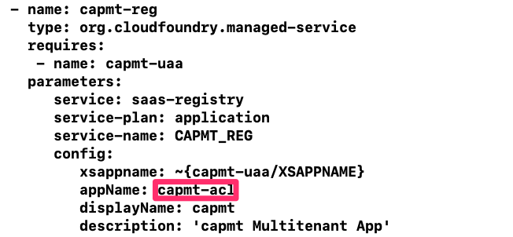
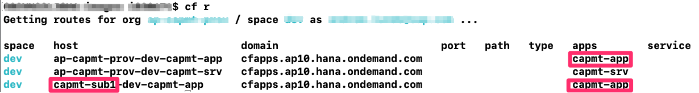

# Subscription Issues

## Name already registered:

Remember that for your app to be made subscribable, it has to be registered with an app name that is unique in the landscape.  
This holds true also if you want to deploy your app in another space or org within your account.

If you're getting messages that look like this in your capmt-srv logs, Try adjusting the appName in the mta.yaml file.

```
Service operation failed: Controller operation failed: 502 Updating service "CAPMT_REG" failed: Bad Gateway: Error creating service "CAPMT_REG" from offering "saas-registry" and plan "application": CF-ServiceBrokerBadResponse(10001): Service broker error: Service broker saas-registry failed with: SaaS application/service with the same appName (its value is: capmt) already registered in SaaS 
Proceeding with automatic retry... (3 of 3 attempts left)
```


## Registration Fails:

If the url that was provided during SaaS registration doesn't match with the srv module's url then subcriptions will fail.  Check it with the following to make sure they are the same.
```
cf app capmt-srv | grep routes
cf env capmt-srv | grep onSubscription
```


## Subscriber route doesn't exist:

If when you subscribe and it's completed, then click the "Go to Application" link, but that fails with a "route not found" error, check that the route for that subaccount's subdomain exists and points to the capmt-app.  In this example the subaccoun't subdomain is **capmt-sub1**

```
cf r
```


If it doesn't then you probably didn't set your credentials the CF_CREDS.sh file and run it.

```
./CF_CREDS.sh
```

Or you may need to manually create a router for the subscriber subaccount.
```
cf map-route capmt-app cfapps.ap10.hana.ondemand.com --hostname=capmt-sub1-dev-capmt-app
```
## Unauthorized:

If you finally get to the app and when you click on the links you get an unauthorized message, then it's likely that you haven't created a Role Collection and added the capmt Roles to it and assigned your user to that Role Collection.  Check the [Getting your head into Cloud Application Programming model multitenancy](https://blogs.sap.com/2020/08/20/getting-your-head-into-cloud-application-programming-model-multitenancy/) blog post for a details.

Even if you do this for your own user, you will have to sign out of Cloud Platform and sign back in again to get the new roll collection effective for your user.

## Other stuff:

Watch the logs while attempting a subscription.  If the logs are to verbose, you can turn that down by commenting out **NODE_DEBUG: 'instance-manager'** in the mta.yaml file.  You should see messages that have this in them.
```
[INFO ][ON_UPDATE_TENANT] XXX_Starting Subscription for capmt-sub1
```
You can also just watch for log entries with 'XXX' in them.
```
cf logs capmt-srv | grep -A 2 XXX
```


